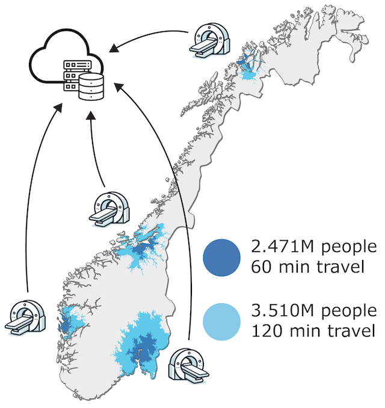

# BOTT Isochrone map

This project is a Python workspace for creating a one-off map visualization of travel times, and population size living within x minutes travel time from the main university hospitals in Norway. The locations/travel times can easily be substituted. Common web APIs typically have a limitation on travel time < 60 minutes, and to circumvent this limitation the project uses the open source routing engine [Valhalla](https://github.com/valhalla/valhalla).
## Output
The output will be a map of Norway with isochrones (travel time contours) and population size within each isochrone. After some post-processing it could look like this:

## Requirements
Docker running something other than apple silicon/arm (or run on a github codespace)
pandas/numpy
geopandas
routingpy
matplotlib

## Running the project

To get started with the project, follow these steps:
1. Run project in a github codespace 
    - local devcontainer might work unless apple silicon/arm
2. make all

Alternate untested instructions:
1. Clone the repository to your local machine with docker installed.
2. Create a virtual environment: `python3 -m venv venv`
3. Activate the virtual environment: `source venv/bin/activate`
4. Install the dependencies: `pip install -r requirements.txt`.
5. make all

If you need >120 minutes travel time, you may change the `isochrone/max_time_contour` variable in `VALHALLA/custom_files/valhalla.json` and restart the docker image (you need to run Valhalla at for the config file to be created)
## License

This project is licensed under the MIT License - see the LICENSE file for details.
